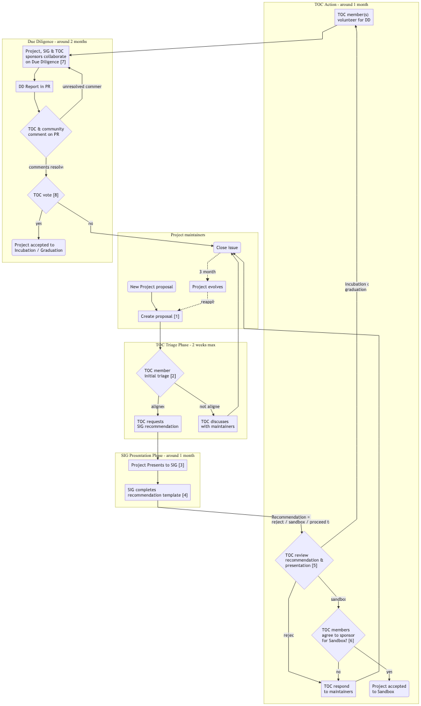

== CNCF Project Proposal Process v1.3

 . *Introduction*. This governance policy sets forth the proposal process for projects to be accepted into the Cloud Native Computing Foundation (“CNCF”). The process is the same for both existing projects which seek to move into the CNCF, and new projects to be formed within the CNCF.
 . *Project Proposal Requirements*. Projects must be proposed via https://github.com/cncf/toc/tree/master/proposals[GitHub]. Project proposals submitted to the CNCF (see https://github.com/cncf/toc/blob/master/proposals/kubernetes.adoc[example]) can be written in https://www.markdownguide.org[Markdown], http://asciidoc.org[AsciiDoc], or http://docutils.sourceforge.net/rst.html[reStructuredText] and must provide the following information to the best of your ability:

TODO!! Convert this to the issue template?

 .. name of project (must be unique within CNCF)
 .. project description (what it does, why it is valuable, origin and history)
 .. statement on alignment with CNCF charter mission
 .. comparison with similar projects (inside or outside the CNCF), including what differentiates this project
 .. sponsor from TOC (sponsor helps mentor projects)
 .. preferred maturity level (see https://github.com/cncf/toc/blob/master/process/graduation_criteria.adoc[CNCF Graduation Criteria])
 .. license (charter dictates http://www.apache.org/licenses/LICENSE-2.0[Apache 2] by default)
 .. source control (GitHub by default)
 .. external dependencies (including licenses)
 .. initial committers (how long working on project, companies they represent)
 .. infrastructure requests (CI / CNCF Cluster)
 .. communication channels (slack, irc, mailing lists)
 .. issue tracker (GitHub by default)
 .. website (current version will move to project.cncf.io, see https://github.com/cncf/foundation/blob/master/website-guidelines.md[here] for guidelines)
 .. release methodology and mechanics
 .. social media accounts
 .. community size and any existing sponsorship
 .. who is currently known to be using the project? Are they using it in production and at what scale? (It may be hard to obtain accurate data for this, but any supporting evidence of usage is helpful)
 .. project logo in svg format (see https://github.com/cncf/artwork#cncf-related-logos-and-artwork for guidelines)

. *Project Acceptance Process*.
.. This flowchart shows the project proposal and assessment process.

[1] A project wishing to join the CNCF first raises an issue in GitHub using the proposal issue template TODO!! Create issue template, and add link here

[2] A TOC member performs an initial triage on this issue:

* TOC member assigns issue to themselves during triage
* TOC member might reach out to project maintainers with questions
* If the TOC member is leaning towards rejecting the project, they will discuss it with other TOC members first before responding
* To request a SIG recommendation, the TOC member assigns issue to the relevant SIG chairs

[3] SIG Chairs co-ordinate with the project maintainers to agree presentation date and answer questions about what is required in this presentation

[4] SIG completes a recommendation template TODO!! Link to recommendation template

[5] TOC review and discuss the recommendation. Note that the TOC have discretion and are not required to accept the recommendation if they disagree. The next step is agreed by lazy consensus amongst the TOC

[6] Sandbox requires sponsors from the TOC members. Sponsors should have a reasonable belief that the project is on a good path towards incubation. If insufficient members step forward as sponsors within the timeframe, then the proposal will be rejected.

[7] https://github.com/cncf/toc/blob/master/process/due-diligence-guidelines.md[Due Diligence] is performed when a Project wants to join or move to Incubation level. The Due Diligence document should also be updated for a Graduation proposal.

[8] For incubation and graduation the TOC vote taking into account the https://github.com/cncf/toc/blob/master/process/graduation_criteria.adoc[requirements]. Projects get accepted via a 2/3 supermajority vote of the TOC.